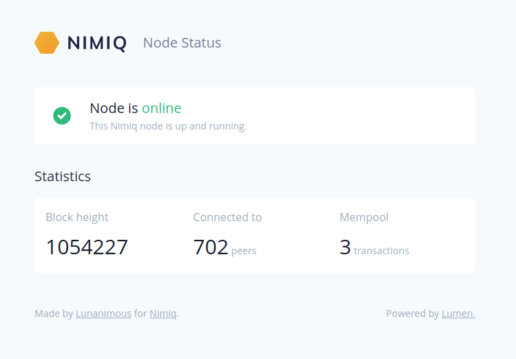

# Nimiq Node Status Page

This is a small application to show status of the Nimiq node.



## Setup

Clone the repository

```bash
git clone https://github.com/lunanimous/node-status.git
```

Download dependencies using Composer

```bash
composer install --prefer-dist
```

Configure `.env` for your node

```
NODE_HOST=node1.lunanimous.com
NODE_PORT=8443
NODE_USERNAME=luna
NODE_PASSWORD=secret
```


